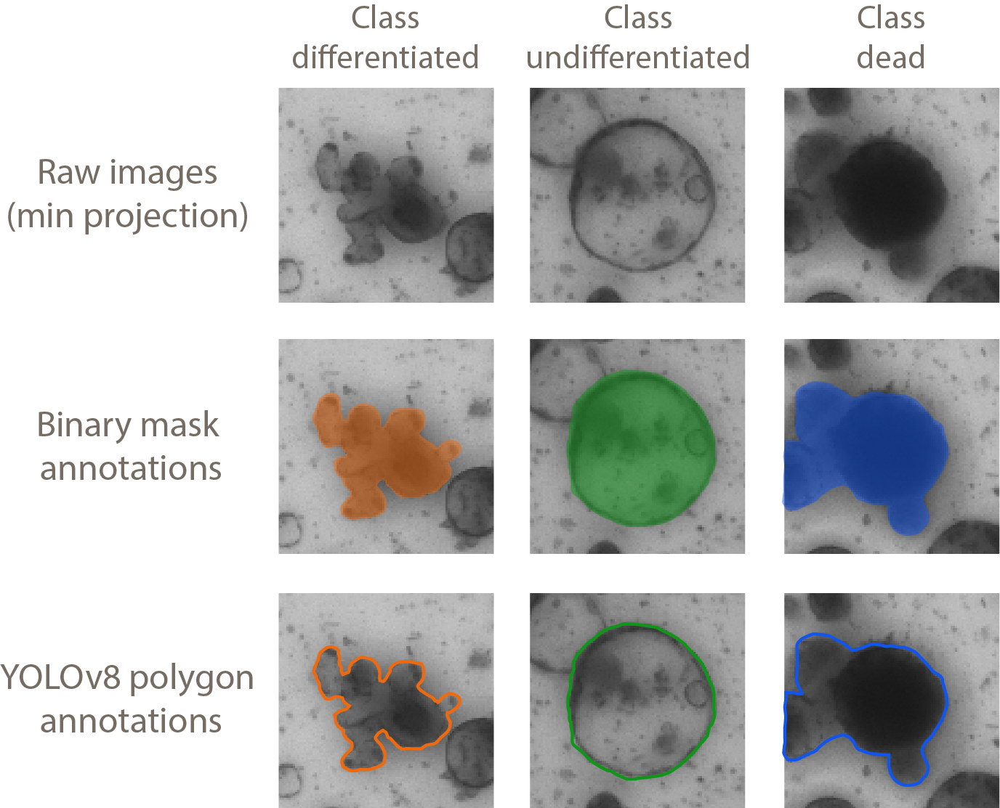
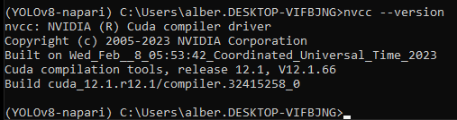

<h1>Training a YOLOv8 model for detection of intestinal organoids in brightfield images</h1>

The goal of this repository is to obtain a custom YOLOv8 model to segment and classify intestinal organoids and spheroids from brightfield images acquired using a widefield microscope. The obtained model will be used in the [intestinal_organoid_brightfield_analysis](https://github.com/adiezsanchez/intestinal_organoid_brightfield_analysis) repository.

As a starting point the ground truth annotations for each raw image (.czi) are in a .tiff file format, where each "channel" contains a binary mask defining instances of each class. Training dataset can be downloaded [here](https://dropbox.com)

In our particular dataset we have 3 classes of intestinal organoids: dead (or overgrown organoids), differentiated (developed organoids) or undifferentiated (aka spheroids). The resulting model will detect, segment and classify each of those instances.

  

In order to train the YOLOv8 the initial binary masks defining each class instances must be converted to COCO polygon .json files and later on into YOLO-style polygon .txt files. Executing the notebooks and .py files in a sequential order (1 to 5) allows to do so.

<h2>Instructions</h2>

1. In order to run these Jupyter notebooks and .py scripts you will need to familiarize yourself with the use of Python virtual environments using Mamba. See instructions [here](https://biapol.github.io/blog/mara_lampert/getting_started_with_mambaforge_and_python/readme.html).

2. Then you will need to create a couple of virtual environments. One to preprocess all the data including napari and opencv, and another one to train the YOLOv8 model.

3. To run Jupyter notebooks and .py files 1 to 4 we will be using the napari-opencv environment that you can create from the YAML file found under the configs folder:

   <code>mamba env create -f napari-opencv.yml --name napari-opencv</code>

4. Finally we will be using a different environment to contain the ultralytics packages needed to train our own YOLOv8 segmentation model (notebook 5). This relies on pytorch, and if you want to leverage CUDA GPU acceleration you'll need to perform a few checks:

  <code># Check your CUDA Toolkit version, in my case it is version 12.1 as you see in the output below</code>
  <code>nvcc --version</code>

  

5. If your CUDA version is 12.1 and cuDNN version is 8.0 you can use the following code to create a working yolov8-GPU environment.

  <code>mamba env create -f yolov8-GPU.yml --name yolov8-GPU</code>

6. Otherwise you'll need to do a bit of Googling.