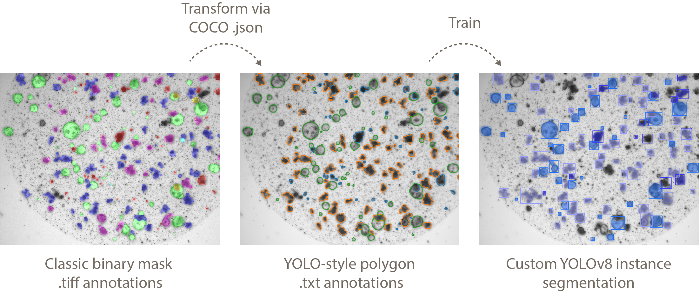
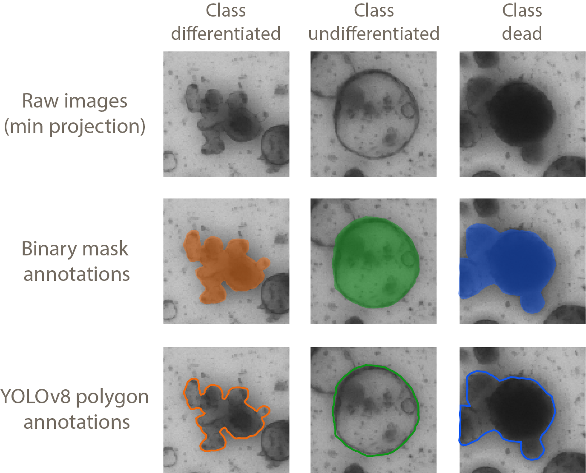
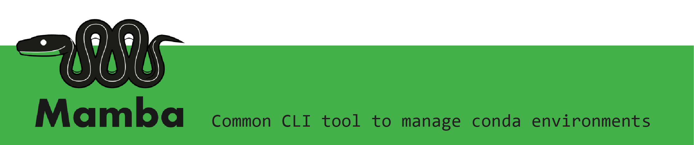
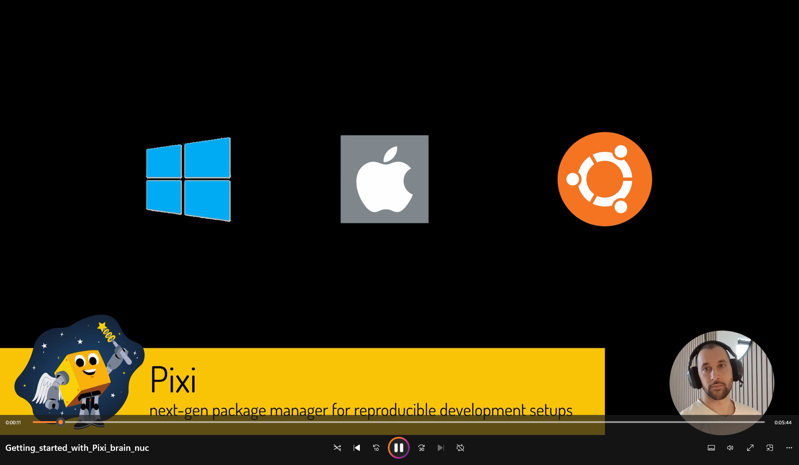

<h1>YOLOv8 model training for detection of intestinal organoids in brightfield images (ISiOS-BF-YOLOseg)</h1>

This repository contains the training workflow used to build a custom YOLOv8 segmentation model for intestinal organoids and spheroids in brightfield widefield microscopy images. The exported model is used downstream in [Instance Segmentation of intestinal Organoids and Spheroids from BrightField images using YOLOv8 (ISiOS-BF-YOLO)](https://github.com/adiezsanchez/intestinal_organoid_yolov8).

Ground truth for each raw `.czi` image is stored in a companion `.tiff` annotation file, where each channel contains a binary mask defining instances of each class. The pipeline converts those masks into COCO polygon `.json` files and then into YOLO-style polygon `.txt` labels before training.

In our dataset we have 3 classes of intestinal organoids: dead (or overgrown organoids), differentiated (developed organoids), and undifferentiated (aka spheroids). The resulting model detects, segments, and classifies each of those instances.

  

1. Download and extract the training dataset with <code>0_data_download.ipynb</code>.

2. Convert raw `.czi` images and instance annotations into a train/validation folder structure with <code>1_czi_to_tiff_and_restructure.ipynb</code>.

3. Convert binary class masks into COCO polygon annotations with <code>2_binary_to_coco_V3.0.py</code>.

4. Convert COCO annotations into YOLO polygon labels and a dataset YAML file with <code>3_coco_to_yolov8_polygon_V3.0.py</code>.

5. Inspect the generated YOLO labels with <code>4_display_yolo_annotations.ipynb</code>.

6. Train and evaluate the YOLOv8 segmentation model with <code>5_training_YOLO_V8_bf_organoids_spheroids.ipynb</code>.

<h2>How to install this tool? (Environment setup)</h2>

> [!TIP]
> In order to run these Jupyter notebooks and .py scripts you will need to familiarize yourself with the use of Python virtual environments, IDEs and Git. If you are not familiar with those concepts watch the [Before you start (Python, IDE and Git on Windows)](https://youtu.be/tzdFuxF2E3U) video, it will guide you through the necessary steps and cover all basic concepts.
>
> TL;DR You are busy in the wet lab, skip to the Pixi section below.

Once you have your developer stack ready you can simply clone this repository using:

<code>git clone https://github.com/adiezsanchez/bf_intorg_YOLOv8_dev</code>

If you do not have git installed you can dowload the code as a .zip file by clicking on the green < > Code button at the upper right corner of the repo.

Proceed to the next step either using **Mamba** or **Pixi** as your environment manager of choice.

1. Create a virtual environment (venv) either using the following command or recreate the environment from the .yml file you can find in the envs folder (step 2):

   <code>mamba create -n int_organoids python=3.9 devbio-napari pytorch torchvision plotly pyqt ultralytics -c conda-forge -c pytorch</code>

2. To recreate the venv from the environment.yml file stored in the envs folder (recommended) navigate into the envs folder using <code>cd envs</code> in your console and then execute:

   <code>mamba env create -f environment.yml</code>

3. The resulting environment will allow you to run the preprocessing and training workflow on the CPU. If you want to leverage your CUDA GPU, check CUDA and cuDNN compatibility with your hardware. For CUDA 12.1 and cuDNN 8, recreate the GPU environment from the envs folder with:

   <code>mamba env create -f environment_GPU.yml</code>

4. The easiest way to interact with the training code is via Jupyter Lab. To launch a jupyter lab server run the following commands:

   <code>mamba activate int_organoids</code>

   <code>jupyter lab</code>

   For GPU training, activate the GPU environment instead:

   <code>mamba activate int_organoids_GPU</code>

|  | Watch on YouTube | Description |
|-------|------------------|-------------|
|  | [Pipeline installation using Pixi](https://youtu.be/tzdFuxF2E3U) | TL;DR You are busy in the wet lab and want to get your hands on in this tool and start using it ASAP.  |

> [!TIP]
> [Pixi](https://pixi.sh/latest/installation/) allows for fully reproducible environments by using .lock files.

After installing pixi, and cloning this repo type the command below. Once it is done installing your virtual environment it will launch a Jupyter Server in your browser so you can interact with the pipelines.

<code>cd bf_intorg_YOLOv8_dev && pixi run lab</code>

> [!WARNING]
> If you run into an ImportError (i.e. DLL load failed while importing _imaging), run the postfix-windows-dll task by typing <code>pixi run postfix-windows-dll</code>. Restart the kernel and import the modules again, this will fix the issue.

<h2>Usage instructions</h2>

1. [Contact Me](mailto:alberto.d.sanchez@ntnu.no) to obtain a fresh working S3 bucket pre-signed link, or use <code>00_presigned_url_generator.ipynb</code> if you maintain the data bucket.

2. Paste the link inside <code>0_data_download.ipynb</code> after <code>presigned_url</code> and run the notebook to download and extract the data.

3. Run <code>1_czi_to_tiff_and_restructure.ipynb</code> to convert `.czi` files, preprocess annotations, and create the train/validation split.

4. Run <code>2_binary_to_coco_V3.0.py</code> and <code>3_coco_to_yolov8_polygon_V3.0.py</code> to generate COCO annotations and YOLO polygon labels.

5. Open <code>4_display_yolo_annotations.ipynb</code> to visually inspect the generated labels.

6. Open <code>5_training_YOLO_V8_bf_organoids_spheroids.ipynb</code> to train and evaluate the YOLOv8 segmentation model.

<h2>Materials and Methods: Model Training</h2>

Brightfield `.czi` images and companion `.tiff` instance annotations were converted to `.tiff` images and per-class binary masks with Python 3.9 (`napari`, `czifile`, `tifffile`, `pyclesperanto-prototype`, `scikit-image`, `pandas`, `scikit-learn`). Annotations were reorganized into train and validation folders for three classes: `dead`, `differentiated`, and `undifferentiated`.

Binary masks were converted to COCO polygon annotations with OpenCV contour extraction, then transformed into YOLO polygon label files and a dataset YAML configuration. Model training and evaluation were performed with `ultralytics` YOLOv8 segmentation using `pytorch` 2.1.2 and CUDA 12.1 on GPU, with pretrained `yolov8n-seg` weights and dataset-specific class counts.

<h2>How to cite this pipeline</h2>

> [!NOTE]
> If you are using this pipeline to train or reuse the resulting YOLOv8 model, you can include it in your references following the instructions below:

- For APA and BibTex style scroll to the top of this page, above the Release section and under About click on the cite this repository.

- For APA, Harvard, MLA, Vancouver, Chicago and IEEE styles, visit [Zenodo](https://doi.org/10.5281/zenodo.20118754) and in the right panel at the bottom you will find the Citation section. 

- If you use the trained model in downstream brightfield plate analysis, also cite the inference pipeline on [Zenodo](https://doi.org/10.5281/zenodo.20085163): 

This is an example from APA, the most popular citation style:

<code>Díez-Sánchez, A. (2026). adiezsanchez/intestinal_organoid_yolov8: ISiOS-BF-YOLO (v1.0.0). Zenodo. https://doi.org/10.5281/zenodo.20118754 </code>

<h2>Related publications</h2>

Placeholder for publications citing this pipeline
